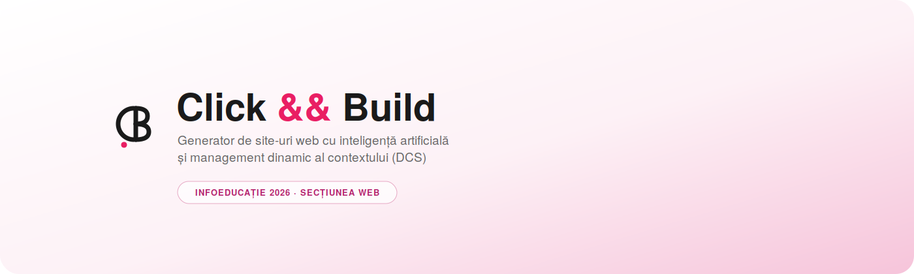
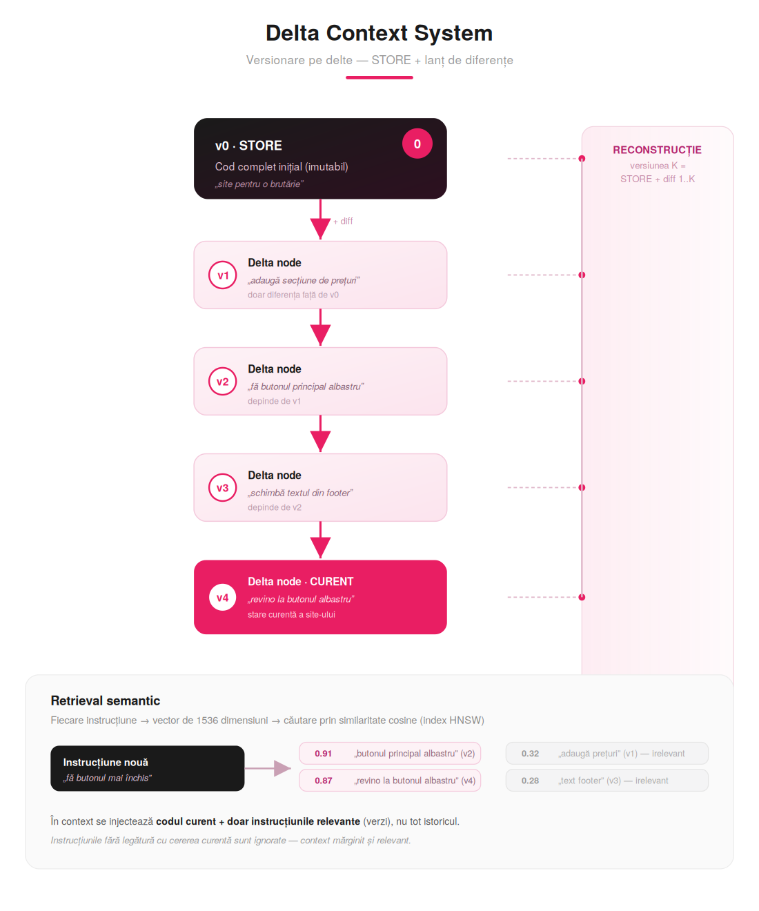
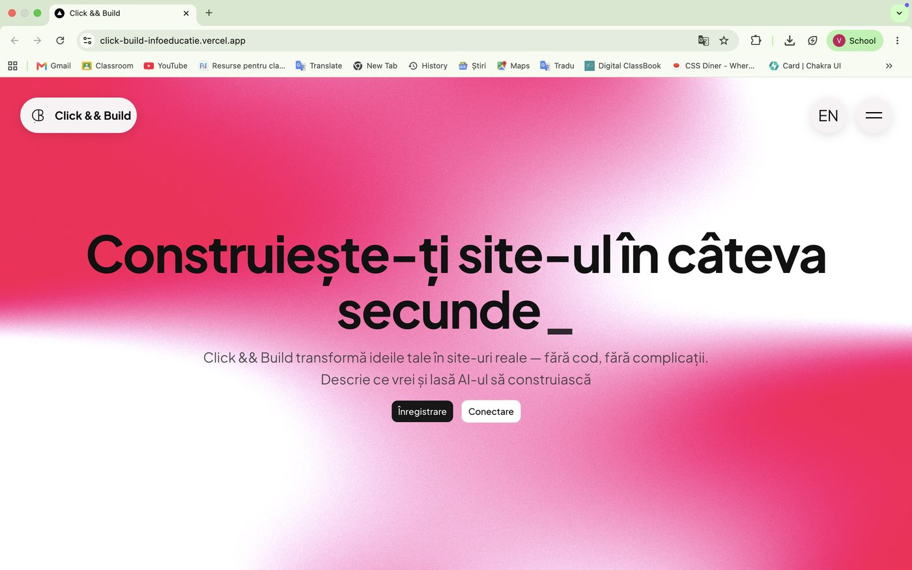
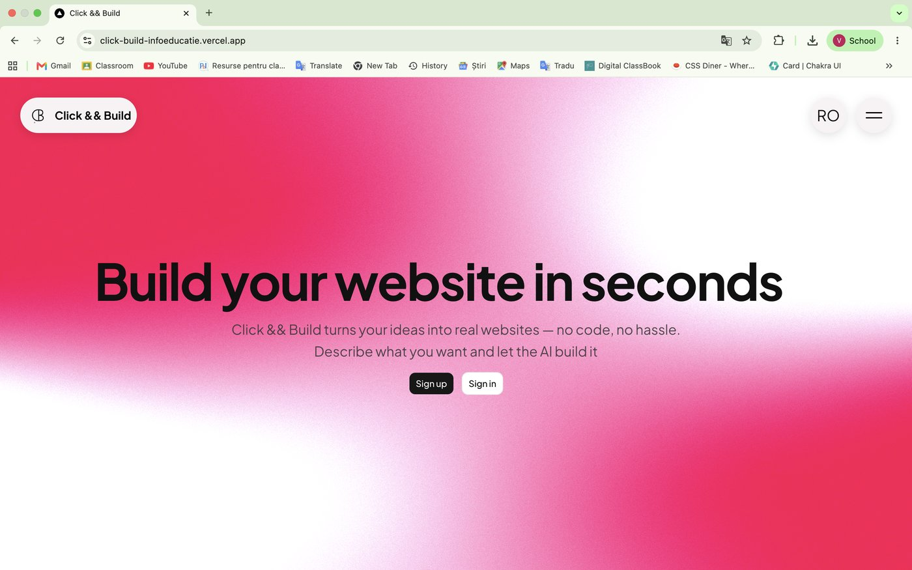
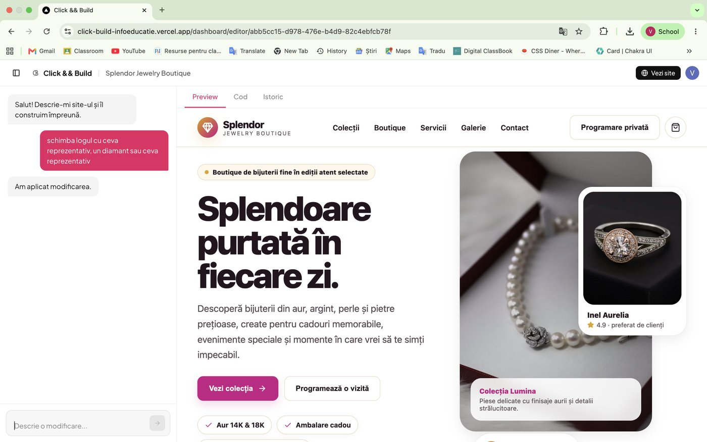
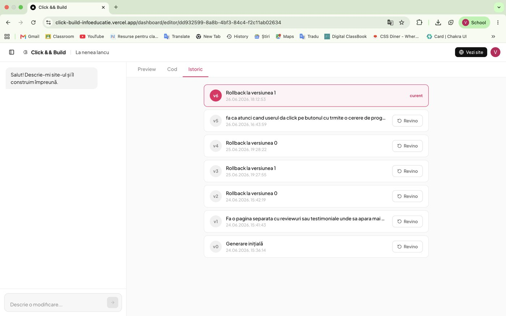
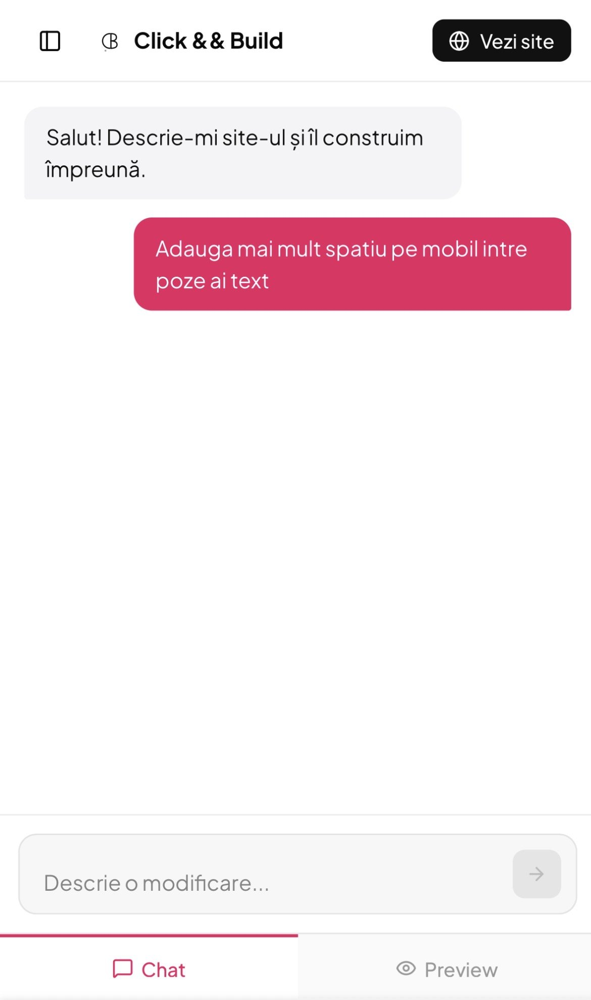
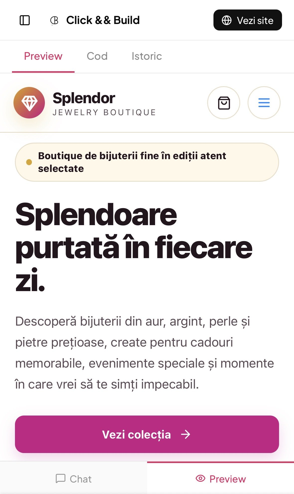

<p align="center">
  
</p>

<p align="center">
  <a href="https://click-build-infoeducatie.vercel.app">🌐 demo live</a>&nbsp;·&nbsp;
  <a href="./docs/Click-and-Build-Documentatie.pdf">📄 documentație tehnică (PDF)</a>&nbsp;·&nbsp;
  <a href="./TEHNOLOGII.md">🧩 tehnologii externe</a>
</p>

<p align="center">
  
  
  
  
  
</p>

---

## Cuprins

- [Ce este Click && Build](#ce-este-click--build)
- [DCS — Delta Context System](#dcs--delta-context-system)
- [Capturi de ecran](#capturi-de-ecran)
- [Funcționalități](#funcționalități)
- [Arhitectură pe scurt](#arhitectură-pe-scurt)
- [Rulare locală](#rulare-locală)
- [Testare](#testare)
- [Structura proiectului](#structura-proiectului)
- [Tehnologii](#tehnologii)
- [Autori](#autori)

---

## Ce este Click && Build

**Click && Build** generează site-uri web complete pornind de la o descriere în limbaj natural. Utilizatorul descrie ce site vrea, aplicația produce un site React funcțional — design profesional, conținut realist, imagini reale — pe care apoi îl poate rafina prin conversație și publica online, la o adresă proprie.

Majoritatea generatoarelor de acest fel retrimit toată conversația la fiecare editare: contextul crește necontrolat, costul explodează, iar modelul „se pierde” în istoricul lung (*lost in the middle*). Click && Build rezolvă asta printr-un sistem propriu de gestionare a contextului — **DCS**.

## DCS — Delta Context System

Contribuția centrală a proiectului. În loc să stocheze fiecare versiune a site-ului ca fișier complet, DCS o stochează ca **diferență (delta)** față de versiunea anterioară — un STORE inițial imutabil, plus un lanț de delte. Reconstrucția oricărei versiuni se face aplicând delta-urile pe rând peste STORE, ceea ce face rollback-ul posibil ca efect secundar al designului, fără să dubleze stocarea.

La editare, fiecare instrucțiune e codată ca vector semantic (1536 dimensiuni) și căutată prin similaritate cosine — în context intră **codul curent + doar instrucțiunile relevante semantic**, nu tot istoricul.

<p align="center">
  
</p>

Rezultatul, măsurat printr-o simulare reproductibilă (50 de editări succesive, tokeni numărați cu `tiktoken`):

| Editarea | Abordare clasică | DCS | Economie |
|---|---|---|---|
| 1 | 1.578 | 1.578 | 0% |
| 10 | 17.149 | 2.122 | 88% |
| 30 | 69.965 | 3.372 | 95% |
| **50** | **147.836** | **4.627** | **97%** |

La a 50-a editare, abordarea clasică depășește fereastra de context tipică a modelelor (128k tokeni) — pur și simplu nu mai funcționează — în timp ce DCS rămâne confortabil sub limită. Simularea completă e integrată în aplicație (`/benchmark`) și poate fi rulată live.

Detaliile complete — arhitectură, bază de date, securitate, decizii de design — sunt în [documentația tehnică](./docs/Click-and-Build-Documentatie.pdf).

## Capturi de ecran

<table>
<tr>
<td width="50%"><p align="center"><sub>Landing — română</sub></p></td>
<td width="50%"><p align="center"><sub>Landing — engleză (i18n propriu, RO/EN)</sub></p></td>
</tr>
<tr>
<td width="50%"><p align="center"><sub>Editorul — chat + preview live</sub></p></td>
<td width="50%"><p align="center"><sub>Timeline DCS — istoric versiuni + rollback semantic</sub></p></td>
</tr>
<tr>
<td width="50%"><p align="center"><sub>Editor pe mobil — mod Chat</sub></p></td>
<td width="50%"><p align="center"><sub>Editor pe mobil — mod Preview</sub></p></td>
</tr>
</table>

## Funcționalități

| Funcționalitate | Descriere |
|---|---|
| Generare din prompt | Site complet React dintr-o descriere în limbaj natural |
| Sugestii automate | Titlu, public țintă și paletă de culori propuse de AI |
| Editare conversațională | Modificări prin mesaje, cu context relevant injectat prin DCS |
| Preview live | Randare instant a site-ului generat, în mediu izolat (sandbox) |
| Istoric versiuni | Timeline complet, cu instrucțiunea fiecărei editări |
| Rollback semantic | Revenire la orice versiune, reconstruită din delte |
| Publicare | Site accesibil public la adresă proprie, fără cont |
| Internaționalizare | Interfață bilingvă RO/EN, sistem propriu |
| Accesibilitate | Contrast ridicat, `prefers-reduced-motion`, focus vizibil la tastatură |
| Benchmark interactiv | Simulare live a economiei de tokeni DCS vs. abordarea clasică |

## Arhitectură pe scurt

```
prompt utilizator
  ↓
gpt-4o-mini        → cuvinte-cheie pentru imagini
  ↓
Unsplash API       → imagini reale (nu placeholder)
  ↓
gpt-4o-mini        → alege un design system ca inspirație
  ↓
gpt-5.5            → generează componenta React completă
  ↓
DCS                → salvează versiunea 0 (STORE) + embedding
```

Editările ulterioare nu reiau acest pipeline — trec prin `/api/edit`, care injectează codul curent + top-5 instrucțiuni relevante semantic (nu tot istoricul), regenerează doar ce trebuie schimbat, și adaugă o nouă deltă în lanțul DCS.

Codul generat de AI rulează într-un `<iframe sandbox="allow-scripts">` **fără** `allow-same-origin` — izolat complet de aplicație, fără acces la cookies, sesiune sau `localStorage`.

## Rulare locală

```bash
git clone https://github.com/victorleustean/Click-Build_INFOEDUCATIE.git
cd Click-Build_INFOEDUCATIE
npm install
```

Creează `.env.local` în rădăcina proiectului cu:

```
NEXT_PUBLIC_SUPABASE_URL=
SUPABASE_SERVICE_ROLE_KEY=
OPENAI_API_KEY=
UNSPLASH_ACCESS_KEY=
NEXT_PUBLIC_CLERK_PUBLISHABLE_KEY=
CLERK_SECRET_KEY=
```

```bash
npm run dev
```

Aplicația pornește pe `http://localhost:3000`. Baza de date (PostgreSQL + extensia `pgvector`) e găzduită pe Supabase — vezi [TEHNOLOGII.md](./TEHNOLOGII.md) pentru toate serviciile externe folosite.

## Testare

Logica critică (reconstrucția DCS din delte, curățarea codului generat, generarea subdomeniilor) e acoperită de teste unitare cu **Vitest**:

```bash
npm run test        # mod watch
npm run test:run    # o singură rulare
```

Testele rulează automat la fiecare push, prin **GitHub Actions** (badge-ul de sus).

## Structura proiectului

```
.
├── app/
│   ├── api/                 # rute serverless: build, edit, suggestion,
│   │                         publish, versions, rollback
│   ├── dashboard/            # dashboard + editor
│   └── s/[subdomain]/        # pagina publică a unui site publicat
├── components/                # interfața (editor, preview, landing)
├── lib/
│   ├── data/                 # acces la date (filtrat per-utilizator) + DCS
│   ├── preview/               # randarea izolată a codului generat
│   ├── benchmark/              # simularea cantitativă DCS
│   ├── validation/             # scheme Zod
│   ├── i18n/                  # internaționalizare RO/EN
│   └── a11y/                  # context de accesibilitate
├── docs/                       # documentație tehnică + capturi
├── .github/workflows/           # CI (Vitest la fiecare push)
└── ...
```

## Tehnologii

Stack-ul complet — framework-uri, servicii și librării externe folosite — e listat transparent, separat de contribuția proprie, în [**TEHNOLOGII.md**](./TEHNOLOGII.md). Contribuția originală (DCS, pipeline-ul de orchestrare, stratul de date, i18n) e detaliată în [documentația tehnică](./docs/Click-and-Build-Documentatie.pdf).

## Autori

**Leuștean Victor-Constantin** · **Tarîța Alexia-Elena**
Colegiul Național „Calistrat Hogaș” Piatra-Neamț
Proiect realizat pentru InfoEducație 2026, secțiunea Web.